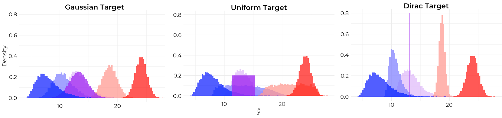
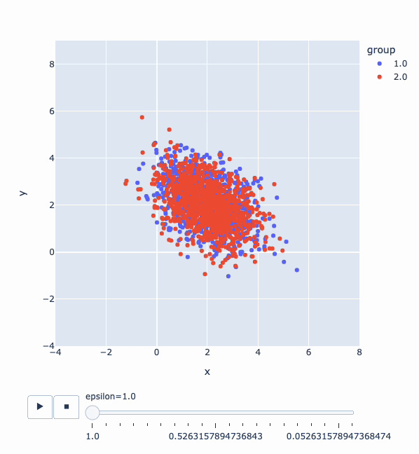

# Parametric Fair Projection with Statistical Guarantees

**The story in short**: We consider fairness applications, where we would like to make predictions independent of a given variable. Much of the work has been centered around Wasserstein Barycenters. We extend this analysis to include Barycenters under Parametric restrictions. The simulations focus on the case where the fair predictions are restricted to gaussian estimators, but as the image below shows, there are different targets possible (here - Gaussian, Uniform and Dirac). 


Further, by using the geodesic distance, we are able to interpolate between the solutions which gives us an approximate fair estimator. As can be seen in the illustration below, the "target" of the fair predictor is distributed according to a gaussian and we can then interpolate via the geodesic distance between this parametric barycenter and the initial predictions. 


## Structure


```
ParamFair
│   README.md
│   requirements.txt
│
└───main
│   |      
│   └───models
│   |   │   benchmark.py
│   |   │   neural_fitters.py
│   |   │   normal_fitters.py
│   │
│   └───training
│   |   │   sampling.py
│   |   │   train_routines.py
│   │
│   └───transport
│       │   fairness_calc.py
│   
└───notebooks
    │   evaluation.ipynb
    │   training.ipynb
    |   table_viz.R
```


## Simulations

## Number
The simulations are based on 20 Bootstrap iterations. 


### Compute
All computations were carried out on a MacBook Pro M1 3.2 GHz. For specifications of the environment see the relevant file